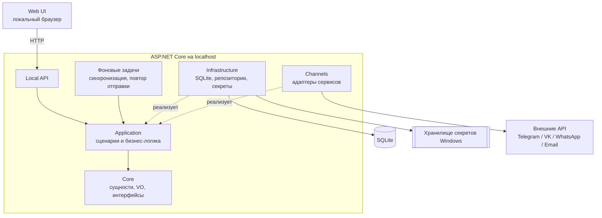
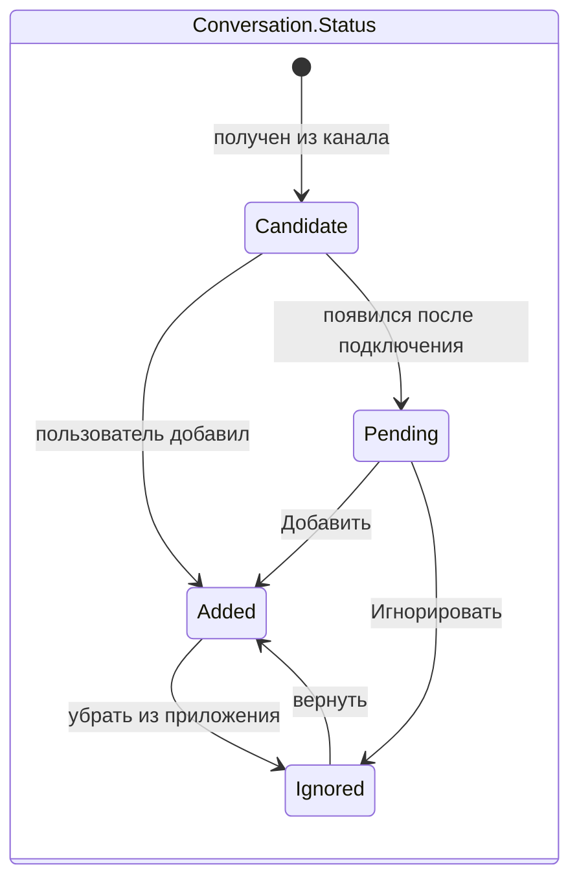
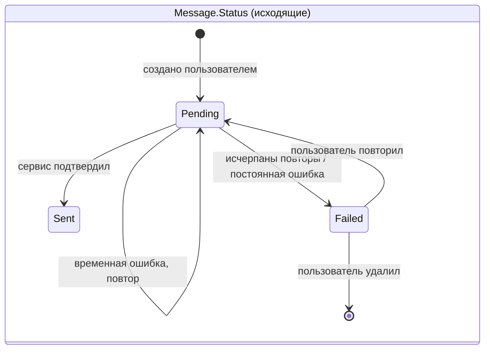
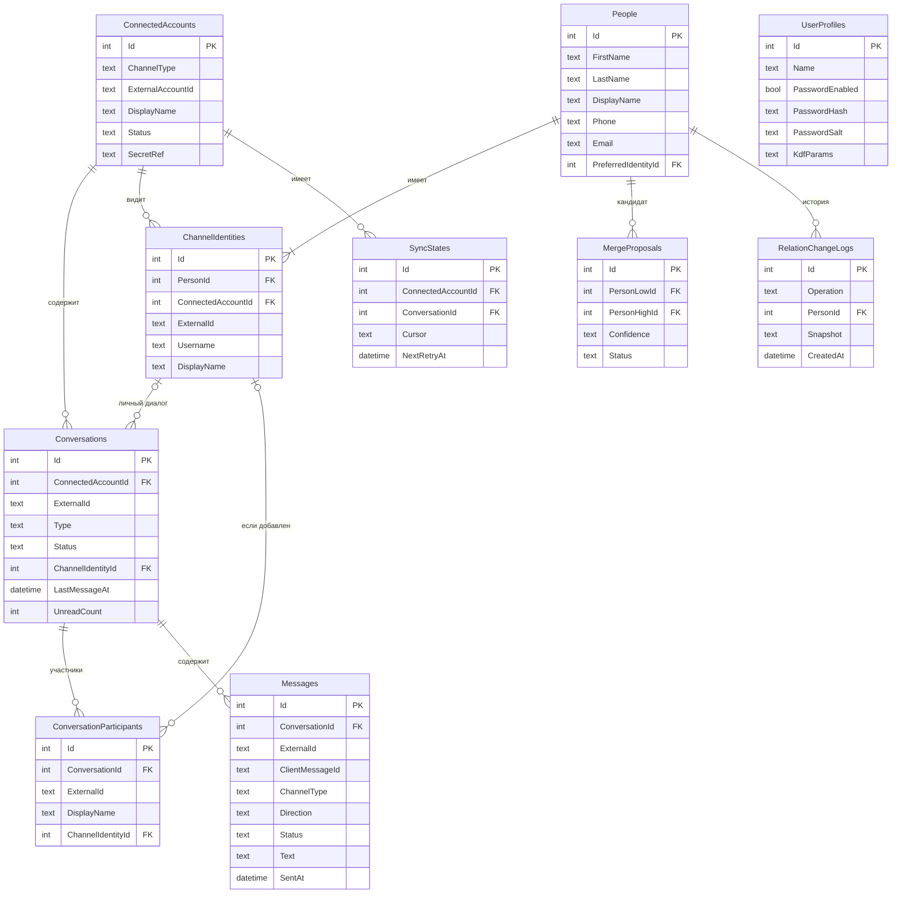
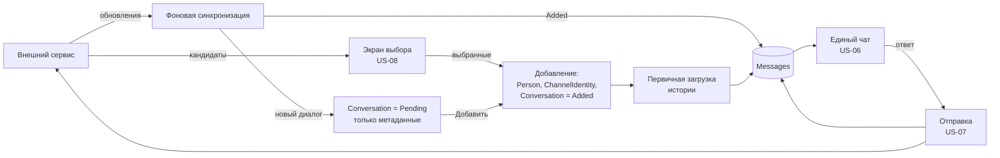
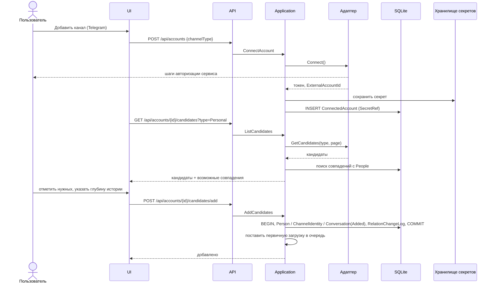
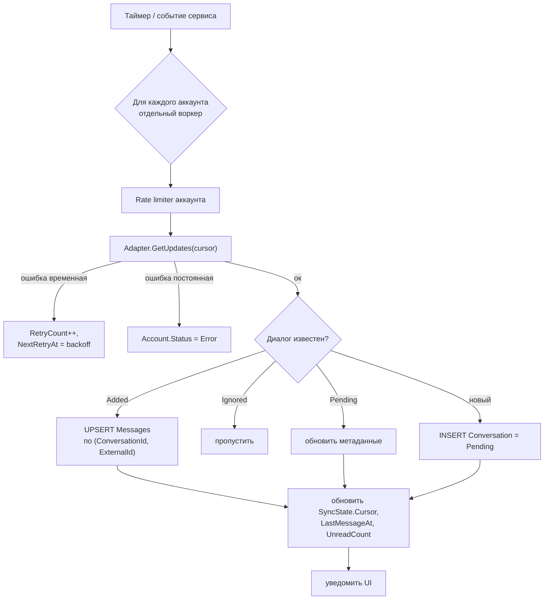
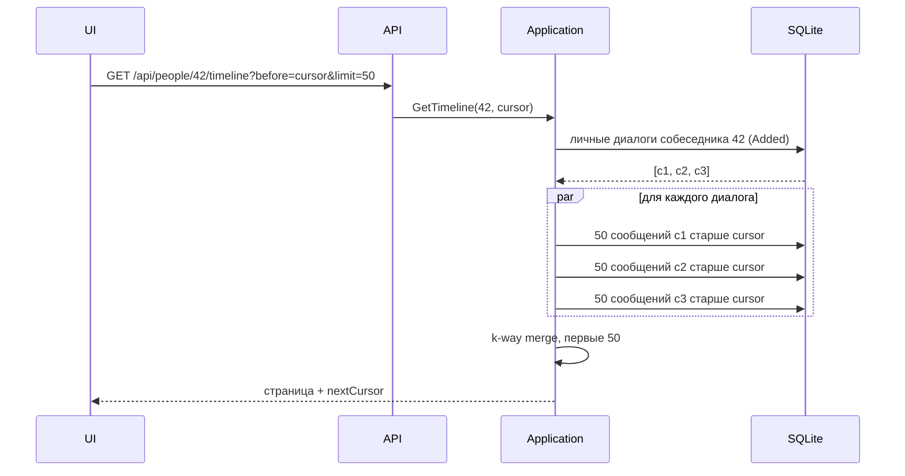
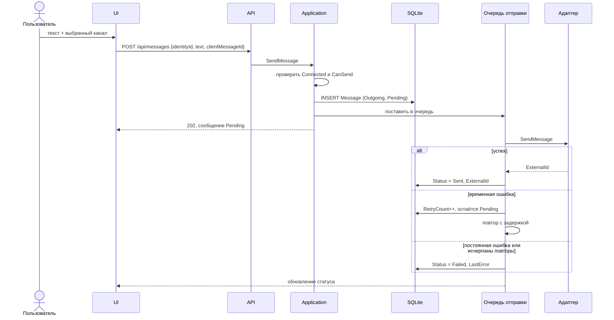
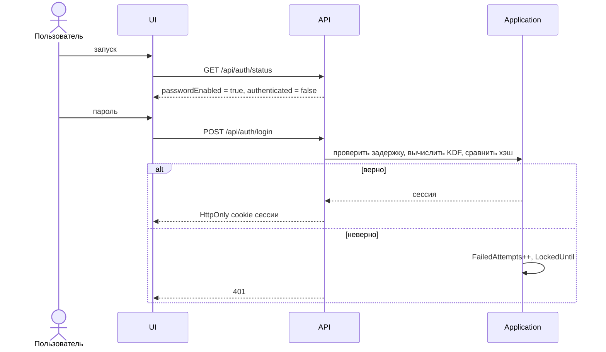

# Техническое задание: Local Messenger Hub

Локальное Windows-приложение для объединения переписок из разных каналов связи в едином интерфейсе.

| Параметр | Значение |
|---|---|
| Версия документа | 2.0 |
| Дата | 22.09.2026 |
| Статус | Проект (проектирование) |
| Версия продукта | v1 |
| Основание | README проекта, user stories заказчика |

> **Главный источник требований — user stories (раздел 3).**
> Все остальные требования либо выводятся из user stories, либо являются системными (безопасность, производительность, надёжность, архитектура).
> При противоречии между user story и любым другим разделом приоритет у user story.

---

## Содержание

0. [История изменений](#0-история-изменений)
1. [Общие сведения](#1-общие-сведения)
2. [Назначение и цели](#2-назначение-и-цели)
3. [User stories](#3-user-stories)
4. [Анализ соответствия README и user stories](#4-анализ-соответствия-readme-и-user-stories)
5. [Базовые проектные решения](#5-базовые-проектные-решения)
6. [Архитектура](#6-архитектура)
7. [Доменная модель](#7-доменная-модель)
8. [База данных](#8-база-данных)
9. [Потоки данных (data flow)](#9-потоки-данных-data-flow)
10. [Функциональные требования](#10-функциональные-требования)
11. [Каналы и адаптеры](#11-каналы-и-адаптеры)
12. [Локальный API](#12-локальный-api)
13. [Пользовательский интерфейс](#13-пользовательский-интерфейс)
14. [Нефункциональные требования](#14-нефункциональные-требования)
15. [Ограничения первой версии](#15-ограничения-первой-версии)
16. [Этапы работ](#16-этапы-работ)
17. [Приёмка](#17-приёмка)
18. [Матрица трассировки](#18-матрица-трассировки)
19. [Открытые вопросы и риски](#19-открытые-вопросы-и-риски)
20. [Перспективы развития](#20-перспективы-развития)
21. [Принципы разработки](#21-принципы-разработки)

---

## 0. История изменений

| Версия | Изменения |
|---|---|
| 1.0 | Первоначальная версия ТЗ по README. |
| 2.0 | User stories добавлены как первичный источник требований. Требования перегруппированы по user stories. Введён единый чат по собеседнику (US-06), выбор канала отправки (US-07), выборочное добавление собеседников, групп и каналов (US-08). Усилены требования конфиденциальности (US-01). Добавлены доменная модель, схема БД, data flow, матрица трассировки, открытые вопросы. Сервис связи оформлен как value object `ChannelType`. Тип диалога «канал» переименован в `Broadcast`. Этапы работ переупорядочены. |

---

## 1. Общие сведения

### 1.1. Наименование

- Полное наименование: локальное приложение агрегации переписок «Local Messenger Hub».
- Условное обозначение: **LMH**.
- Тип: локальное клиент-серверное приложение для Windows. Серверная часть работает на том же компьютере, интерфейс открывается в локальном браузере.

### 1.2. Обозначения требований

| Префикс | Вид |
|---|---|
| `US-NN` | User story (первичное требование) |
| `ФТ-NNN` | Функциональное требование. Первая цифра — номер user story (`ФТ-6xx` → US-06), `ФТ-9xx` — сопутствующие |
| `НФТ-NN` | Нефункциональное требование |
| `АРХ-NN` | Архитектурное требование |
| `БЗ-NN` | Требование безопасности |
| `ПР-NN` | Критерий приёмки версии |
| `ОВ-NN` | Открытый вопрос, требующий решения заказчика |

### 1.3. Приоритеты

- **Обязательно** — входит в объём v1, без этого версия не принимается.
- **Желательно** — реализуется при наличии ресурса, приёмку не блокирует.

### 1.4. Термины

| Термин | Определение |
|---|---|
| Пользователь | Владелец приложения на данном компьютере. В v1 один. |
| Канал связи, сервис | Внешний сервис обмена сообщениями: Telegram, VK, WhatsApp, Email. В коде — `ChannelType`. |
| Подключённый аккаунт | Аккаунт пользователя в конкретном сервисе (`ConnectedAccount`). У пользователя может быть несколько аккаунтов одного сервиса. |
| Собеседник | Реальный человек, которого пользователь добавил в приложение (`Person`). Может быть связан с несколькими каналами. |
| Идентичность в канале | Учётная запись собеседника в конкретном канале (`ChannelIdentity`): `@ivan_petrov` в Telegram, `ivan@example.com` в Email. |
| Диалог | Переписка в конкретном канале (`Conversation`): личный, групповой, broadcast, иной. |
| Broadcast | Односторонний канал-рассылка (например, канал в Telegram). В интерфейсе может называться «Каналы (рассылки)». Переименован во избежание путаницы с «каналом связи». |
| Единый чат | Лента сообщений с собеседником, собранная из всех его личных диалогов во всех каналах, упорядоченная по времени (US-06). |
| Кандидат | Контакт, группа или broadcast в подключённом канале, доступный для добавления в приложение (US-08). |
| Новый диалог | Диалог, появившийся в канале после подключения и ещё не добавленный пользователем. |
| Merge / Split | Объединение двух собеседников в одного / разделение собеседника на нескольких. |

---

## 2. Назначение и цели

### 2.1. Назначение

Система позволяет одному пользователю работать с перепиской из нескольких сервисов в едином интерфейсе на локальном компьютере Windows. Пользователь подключает свои аккаунты, выбирает, каких собеседников, группы и каналы добавить, и общается с каждым собеседником в едином чате независимо от того, через какой канал идёт переписка.

### 2.2. Ключевой сценарий

```text
Иван Петров
├── Telegram: @ivan_petrov
├── VK: id123456
├── WhatsApp: +7...
└── Email: ivan@example.com
```

В интерфейсе это **один собеседник и один чат**, в котором видны сообщения из всех четырёх каналов с пометкой канала у каждого сообщения. Отвечать можно в любой из этих каналов.

### 2.3. Цели

1. Снизить когнитивную нагрузку: единый источник информации вместо нескольких приложений (US-02).
2. Дать полную картину общения с человеком независимо от канала (US-06).
3. Хранить в приложении только нужных пользователю собеседников и диалоги (US-08).
4. Обеспечить конфиденциальность личной переписки (US-01): локальное хранение, защита паролем, защита секретов.
5. Работать на слабых Windows-компьютерах.
6. Сохранить возможность вынести backend на сервер и добавлять каналы без переписывания бизнес-логики.

---

## 3. User stories

User stories являются первичными требованиями. Для каждой указаны трактовка, критерии приёмки и связанные требования.

### US-01. Авторизация

> Как пользователь я хочу иметь возможность авторизоваться для сохранения конфиденциальности своих данных.

**Трактовка.** Авторизация локальная: вход в приложение по паролю локального профиля, без учётной записи на внешнем сервере. Слово «возможность» означает, что пароль включается пользователем и не обязателен. Цель «конфиденциальность» означает, что пароль должен закрывать не только экран, но и доступ к данным через локальный API. Секреты каналов защищаются средствами ОС всегда, независимо от наличия пароля.

**Критерии приёмки:**

- [ ] Пользователь может включить пароль, задав и подтвердив его.
- [ ] При включённом пароле при запуске отображается экран входа. До входа ни UI, ни локальный API не отдают пользовательских данных.
- [ ] Неверный пароль отклоняется. После нескольких неудачных попыток подряд вводится нарастающая задержка.
- [ ] Пользователь может заблокировать приложение вручную (выход).
- [ ] Пароль хранится только как хэш с солью, вычисленный медленной функцией (PBKDF2 / Argon2 и аналоги).
- [ ] Сменить или отключить пароль можно только после ввода текущего.
- [ ] При выключенном пароле в настройках явно отображается, что вход не защищён.
- [ ] Токены и пароли каналов никогда не хранятся в открытом виде.

**Связанные требования:** ФТ-101…ФТ-108, БЗ-01…БЗ-10, ОВ-01, ОВ-02.

---

### US-02. Добавление канала связи

> Как пользователь я хочу возможность добавить канал связи, чтобы облегчить когнитивную нагрузку и иметь единый источник информации.

**Трактовка.** Пользователь подключает свой аккаунт в сервисе (Telegram, VK, WhatsApp, Email). После подключения пользователь переходит к выбору, что добавить из канала (US-08). Управление подключёнными аккаунтами (отключение, переподключение, проверка) относится сюда же.

**Критерии приёмки:**

- [ ] В разделе «Каналы» показан список доступных сервисов (формируется из зарегистрированных адаптеров).
- [ ] Пользователь проходит авторизацию в выбранном сервисе средствами, которые этот сервис поддерживает.
- [ ] Можно подключить несколько аккаунтов одного сервиса.
- [ ] Для каждого аккаунта отображается состояние: Connected / Disconnected / Error, дата подключения, дата последней синхронизации, причина ошибки (без секретов).
- [ ] Пользователь выбирает глубину загрузки истории: не загружать / 7 / 30 / 90 дней / вся доступная (последнее — только если сервис это позволяет).
- [ ] Сразу после подключения открывается выбор кандидатов для добавления (US-08).
- [ ] Можно отключить, переподключить аккаунт и проверить соединение.
- [ ] Ошибка одного аккаунта не влияет на работу остальных.

**Связанные требования:** ФТ-201…ФТ-210, ФТ-901…ФТ-908.

---

### US-03. Настройки приложения

> Как пользователь я хочу иметь настройки приложения, чтобы индивидуально настроить приложение под себя.

**Критерии приёмки:**

- [ ] Общие настройки: язык, тема, запуск вместе с Windows, уведомления, интервал синхронизации.
- [ ] Настройки безопасности: включение, смена, отключение пароля; автоблокировка по неактивности.
- [ ] Настройки хранения: расположение файла БД, правила хранения истории.
- [ ] Настройки для каждого подключённого аккаунта: включение синхронизации, отображаемые по умолчанию типы кандидатов (личные / группы / broadcast / иные).
- [ ] Настройки технического логирования: включение и уровень детализации.
- [ ] Изменения применяются без перезапуска, кроме явно помеченных (например, перенос файла БД).
- [ ] Для каждой настройки есть разумное значение по умолчанию.

**Связанные требования:** ФТ-301…ФТ-308.

---

### US-04. Список собеседников

> Как пользователь я хочу возможность просмотра списка добавленных собеседников, чтобы знать кто добавлен в приложение.

**Трактовка.** Список содержит **только** собеседников, которых пользователь добавил (напрямую через US-08 или вручную). Участники групп, авторы сообщений в broadcast и новые, не добавленные диалоги в этот список не попадают.

**Критерии приёмки:**

- [ ] Отображается список добавленных собеседников: имя, иконки подключённых каналов, дата последней активности.
- [ ] Список загружается порциями и виртуализирован.
- [ ] Список можно отфильтровать по каналу и найти собеседника по имени.
- [ ] Из списка можно открыть карточку собеседника и его единый чат.
- [ ] Участники групп не появляются в списке, пока пользователь явно их не добавит.

**Связанные требования:** ФТ-401…ФТ-405.

---

### US-05. Редактирование собеседника

> Как пользователь я хочу возможность редактирования собеседника, чтобы управлять неактуальными данными.

**Трактовка.** Сюда входит редактирование полей, управление привязанными каналами, объединение дублей (merge), разделение ошибочно объединённых (split) и удаление собеседника из приложения. Merge и split выведены из этой user story и из US-06: без них невозможно собрать один чат из разных каналов и исправить ошибку сопоставления.

**Критерии приёмки:**

- [ ] Можно изменить поля: имя, фамилия, отображаемое имя, телефон, email, заметка.
- [ ] Можно привязать к собеседнику идентичность из другого канала и отвязать её.
- [ ] Можно объединить двух собеседников в одного; их диалоги попадают в один единый чат.
- [ ] Можно разделить собеседника, выбрав, какие идентичности уходят в новый профиль. Сообщения не удаляются и переходят вместе со своими идентичностями.
- [ ] Можно удалить собеседника из приложения с выбором: сохранить локальную историю или удалить её.
- [ ] Система показывает предложения по объединению с причинами; пользователь подтверждает или отклоняет.
- [ ] Все изменения связей фиксируются в журнале, журнал можно просмотреть в карточке собеседника.

**Связанные требования:** ФТ-501…ФТ-515.

---

### US-06. Единый чат из разных каналов

> Как пользователь я хочу возможность чтения переписки, составленной из разных каналов в одном чате, чтобы иметь полную картину общения с человеком и видеть детали обсуждения из разных каналов.

**Трактовка.** Это центральная функция продукта. Для каждого собеседника существует **один** чат, в котором сообщения всех его личных диалогов во всех каналах идут одной лентой по времени. Каждое сообщение помечено каналом. В хранилище диалоги остаются раздельными по каналам (`Conversation`), единый чат — это представление.

Групповые диалоги и broadcast отображаются отдельными чатами и в единый чат собеседника не входят (см. ОВ-04).

**Критерии приёмки:**

- [ ] В разделе «Чаты» у каждого собеседника один элемент списка, независимо от числа каналов.
- [ ] Элемент списка показывает: имя, последнее сообщение и его канал, дату, суммарное число непрочитанных по всем каналам.
- [ ] В едином чате сообщения из всех каналов собеседника упорядочены по времени отправки.
- [ ] У каждого сообщения видно, из какого канала (и какого аккаунта, если их несколько) оно пришло.
- [ ] История подгружается порциями по 50 сообщений при прокрутке вверх; вся история в память не загружается.
- [ ] Можно временно отфильтровать единый чат по одному каналу.
- [ ] После merge сообщения обоих собеседников отображаются в одном чате; после split — расходятся по соответствующим чатам.
- [ ] Групповые чаты и broadcast отображаются в «Чатах» отдельными элементами.
- [ ] Открытие чата отмечает сообщения прочитанными локально.

**Связанные требования:** ФТ-601…ФТ-610.

---

### US-07. Отправка сообщения в выбранный канал

> Как пользователь я хочу возможность отправки сообщений выбранному пользователю в выбранный канал, чтобы удобно общаться с собеседником.

**Трактовка.** Отправка выполняется из единого чата собеседника. Пользователь явно видит и может изменить канал, в который уйдёт сообщение.

**Критерии приёмки:**

- [ ] В поле ввода единого чата есть переключатель канала отправки.
- [ ] По умолчанию выбран канал последнего входящего сообщения от собеседника; если входящих нет — предпочтительный канал собеседника; если он не задан — первый доступный.
- [ ] В переключателе доступны только каналы, в которых аккаунт подключён и сервис поддерживает отправку. Недоступные показаны неактивными с причиной.
- [ ] Отправленное сообщение сразу появляется в едином чате с пометкой канала и статусом «Отправляется».
- [ ] Статусы: Pending → Sent или Failed. Сообщение при ошибке не исчезает.
- [ ] Неотправленное сообщение можно повторить или удалить.
- [ ] Пользователь может задать предпочтительный канал собеседника в карточке.
- [ ] Можно отправить сообщение и в групповой чат, если сервис это поддерживает.

**Связанные требования:** ФТ-701…ФТ-709.

---

### US-08. Выбор, что добавить из канала

> Как пользователь я хочу выбрать кого добавить из канала: собеседников, группы, каналы. Чтобы в списке собеседников были только нужные собеседники.

**Трактовка.** Приложение **не импортирует автоматически** все диалоги канала. После подключения и в любой момент позже пользователь видит список кандидатов и отмечает нужных. Сообщения сохраняются только для добавленных диалогов. Диалоги, появившиеся позже, попадают в очередь «Новые диалоги» и ждут решения пользователя.

**Критерии приёмки:**

- [ ] После подключения аккаунта открывается экран выбора кандидатов, разделённый на вкладки: личные / группы / broadcast / иные.
- [ ] Для кандидатов показаны имя, тип, дата последней активности; есть поиск и фильтр.
- [ ] Можно выбрать нескольких кандидатов сразу («выбрать все» на вкладке — тоже).
- [ ] Добавляются только выбранные. Невыбранные не сохраняются как собеседники и их сообщения не сохраняются.
- [ ] При добавлении личного контакта система проверяет совпадение с уже добавленными собеседниками и предлагает привязать к существующему вместо создания нового.
- [ ] Добавление групп и broadcast не создаёт собеседников из их участников.
- [ ] Экран выбора кандидатов можно открыть повторно из раздела «Каналы».
- [ ] Новые диалоги, появившиеся после подключения, попадают в раздел «Новые диалоги» с действиями «Добавить» и «Игнорировать». Проигнорированные больше не предлагаются, но их можно вернуть.
- [ ] Добавленный диалог можно убрать из приложения.

**Связанные требования:** ФТ-801…ФТ-812, ОВ-03.

---

## 4. Анализ соответствия README и user stories

Проверка выполнена по каждому разделу README и ТЗ v1.0. Ниже перечислены расхождения и принятые решения.

### 4.1. Расхождения и изменения

| № | Было в README / ТЗ v1.0 | Что требует user story | Решение в ТЗ v2.0 |
|---|---|---|---|
| 1 | Раздел «Чаты» — список диалогов, каждый в своём канале | US-06: один чат с человеком из разных каналов | «Чаты» показывают единые чаты по собеседникам плюс отдельные групповые чаты и broadcast. Хранение остаётся по каналам, единый чат — представление. Добавлен алгоритм постраничной загрузки ленты из нескольких диалогов (раздел 9.4). |
| 2 | Отправка в конкретный диалог | US-07: выбор канала при отправке собеседнику | Переключатель канала в едином чате с правилом выбора по умолчанию и фильтром по возможностям сервиса. |
| 3 | Синхронизируются все диалоги включённых типов | US-08: пользователь сам выбирает, кого добавить | Выборочное добавление кандидатов. Флажки типов диалогов стали фильтрами экрана выбора, а не правилом автоимпорта. Добавлена очередь «Новые диалоги». |
| 4 | Участники групп сохраняются и сопоставляются с Person | US-04 и US-08: в списке только нужные собеседники | Участники групп хранятся только как участники диалога и не становятся собеседниками без явного действия пользователя. |
| 5 | Пароль необязателен, экран ввода пароля при старте | US-01: цель — конфиденциальность | Необязательность сохранена («возможность»). Добавлены: защита локального API сессией, проверка Origin, блокировка, задержка после неудачных попыток, медленная KDF. Шифрование файла БД вынесено в ОВ-01. |
| 6 | Объединение и разделение людей — развёрнутые требования без user story | Прямой user story нет | Требования сохранены как вытекающие из US-05 (управление данными) и US-06 (без связывания каналов единый чат невозможен). Предложения объединения также показываются при добавлении кандидата (US-08). |
| 7 | Не было удаления человека | US-05: управление неактуальными данными | Добавлено удаление собеседника с выбором судьбы локальной истории. |
| 8 | Поиск — обязательный раздел | Нет user story | Понижен до «Желательно». В критериях готовности README поиска не было. Предложена US-09 (раздел 4.2). |
| 9 | Уведомления — глобальный переключатель | Нет user story | Понижены до «Желательно». Предложена US-10. |
| 10 | Единая модель Person реализуется на этапе 4, после первого канала | US-06, US-08 требуют собеседника с первого подключённого канала | Этапы переупорядочены: доменная модель до первого канала (раздел 16). |
| 11 | Слово «канал» в трёх смыслах | — | Сервис — `ChannelType`, аккаунт — `ConnectedAccount`, тип диалога — `Broadcast`. |
| 12 | Синхронизация, безопасность, производительность, логирование | Прямых user story нет | Сохранены как системные требования, обеспечивающие US-02, US-06, US-07, US-01. |

### 4.2. Предлагаемые дополнительные user stories

Требуют подтверждения заказчиком. До подтверждения связанные требования имеют приоритет «Желательно».

- **US-09 (предложение).** Как пользователь я хочу искать по собеседникам и тексту сообщений, чтобы быстро находить нужную информацию.
- **US-10 (предложение).** Как пользователь я хочу получать уведомления о новых сообщениях, чтобы не пропускать важное.

### 4.3. Итог проверки

- Каждая user story покрыта функциональными требованиями и критериями приёмки (раздел 18).
- Требований, противоречащих user stories, в ТЗ v2.0 не осталось.
- Требования без user story либо системные, либо понижены до «Желательно» с предложением новой user story.

---

## 5. Базовые проектные решения

Решения считаются принятыми и не пересматриваются без конкретной технической причины.

| Аспект | Решение |
|---|---|
| Платформа | Windows |
| Режим | Local-first, полностью локальная работа |
| Серверная часть | ASP.NET Core на localhost |
| БД | SQLite, локальный файл |
| Интерфейс | Простой Web UI в локальном браузере |
| Контейнеры | Без Docker в v1 |
| Пользователи | Один локальный пользователь |
| Каналы | Telegram, VK, WhatsApp, Email |
| Сообщения | Текст хранится локально |
| Вложения | Не хранятся в v1 |
| Синхронизация | Фоновая, инкрементальная |
| Добавление собеседников | Выборочное, по решению пользователя (US-08) |
| Представление переписки | Единый чат по собеседнику (US-06) |
| Сопоставление людей | Правила + подтверждение пользователем |
| ML / AI | Нет в v1 |
| Сервис связи в модели | Value object `ChannelType` со строковым кодом |
| Архитектура | Модульный монолит, разделение по слоям |
| Перспектива | Возможен вынос backend на сервер |

Порядок оценки спорных решений:

```text
Простота → Надёжность → Производительность → Безопасность → Расширяемость
```

Каждая дополнительная технология должна отвечать на вопрос: какую реальную проблему проекта она решает.

---

## 6. Архитектура

### 6.1. Схема первой версии



Перспективная схема (вне объёма v1, но не должна блокироваться решениями v1):

```text
Web / Desktop / Mobile  →  Remote ASP.NET Core  →  Database + Channel Adapters
```

### 6.2. Состав решения

| Проект | Назначение |
|---|---|
| `LocalMessengerHub.Core` | Сущности, value objects, доменные интерфейсы. Без внешних зависимостей. |
| `LocalMessengerHub.Application` | Сценарии использования, бизнес-правила, интерфейсы репозиториев и адаптеров, реестр каналов. |
| `LocalMessengerHub.Infrastructure` | SQLite, миграции, репозитории, хранение секретов. |
| `LocalMessengerHub.Channels` | Адаптеры Telegram, VK, WhatsApp, Email. |
| `LocalMessengerHub.Api` | ASP.NET Core API, фоновые задачи, раздача статики UI. |
| `LocalMessengerHub.Web` | Web-интерфейс. Может быть статикой внутри `Api`. |
| `tests/*` | Модульные, интеграционные и API-тесты. |

Количество и названия проектов могут быть уточнены при проектировании без нарушения требований АРХ.

### 6.3. Зависимости

```text
Web → Api → Application → Core
Infrastructure → Application → Core
Channels → Application → Core
```

### 6.4. Архитектурные требования

| ID | Требование | Приоритет |
|---|---|---|
| АРХ-01 | Бизнес-логика не зависит от Windows, UI и конкретного сервиса. | Обязательно |
| АРХ-02 | `Core` не зависит от ASP.NET Core, SQLite, API сервисов, UI, Windows API. | Обязательно |
| АРХ-03 | Бизнес-правила находятся в `Application`, не в контроллерах и не в UI. | Обязательно |
| АРХ-04 | Каждый сервис реализуется отдельным адаптером за интерфейсом `IChannelAdapter`. | Обязательно |
| АРХ-05 | Добавление сервиса не требует изменения `Core` и бизнес-логики: адаптер регистрируется в DI и объявляет свой `ChannelType` и возможности. | Обязательно |
| АРХ-06 | UI определяет доступность действий по возможностям адаптера (`ChannelCapabilities`), а не по названию сервиса. | Обязательно |
| АРХ-07 | Локальный API не зависит от UI и пригоден для других клиентов. | Обязательно |
| АРХ-08 | Доступ к данным — через репозитории/запросы `Infrastructure`. SQL из контроллеров и UI запрещён. | Обязательно |
| АРХ-09 | Единый чат (US-06) — представление поверх диалогов, а не отдельная копия сообщений. | Обязательно |
| АРХ-10 | Операции merge, split, добавления и удаления собеседника выполняются одной транзакцией. | Обязательно |
| АРХ-11 | Один код для всех конфигураций железа: без ветвления логики по объёму RAM или типу CPU. Производительность регулируется параметрами настроек (раздел 14.1). | Обязательно |

Корректное прохождение операции:

```text
UI → API → Application Service → Repository → SQLite
```

Недопустимо:

```text
Controller → SQL → Business rules → Telegram API
```

---

## 7. Доменная модель

### 7.1. Сущности и value objects

| Элемент | Вид | Идентичность | Назначение |
|---|---|---|---|
| `UserProfile` | Сущность | Id | Локальный профиль пользователя, пароль. |
| `ConnectedAccount` | Сущность | Id | Аккаунт пользователя в сервисе. |
| `Person` | Сущность, агрегат | Id | Собеседник. |
| `ChannelIdentity` | Сущность внутри агрегата `Person` | Id | Учётная запись собеседника в канале. Сущность, потому что переносится при merge/split и на неё ссылаются диалоги и журнал. |
| `Conversation` | Сущность | Id | Диалог в конкретном канале. |
| `ConversationParticipant` | Сущность | Id | Участник группового диалога. Не является собеседником. |
| `Message` | Сущность | Id | Текстовое сообщение. |
| `MergeProposal` | Сущность | Id | Предложение объединить двух собеседников. |
| `RelationChangeLog` | Сущность (append-only) | Id | Журнал изменений связей. |
| `SyncState` | Сущность | Id | Курсор и состояние синхронизации. |
| `ChannelType` | Value object | нет | Код сервиса: `telegram`, `vk`, `whatsapp`, `email`. |
| `ExternalId` | Value object | нет | Внешний идентификатор в сервисе. |
| `PhoneNumber` | Value object | нет | Телефон в нормализованном виде (E.164). |
| `EmailAddress` | Value object | нет | Email в нормализованном виде. |
| `MessageCursor` | Value object | нет | Позиция в ленте: `(SentAt, MessageId)`. |
| `ChannelCapabilities` | Value object | нет | Возможности сервиса, объявляемые адаптером. |

### 7.2. ChannelType

`ChannelType` — value object без идентичности, равенство по коду. Список допустимых значений **не** зашивается в `Core`: корректность формата проверяет VO, существование адаптера — `ChannelRegistry` в `Application`.

```csharp
public sealed record ChannelType
{
    public string Code { get; }
    private ChannelType(string code) => Code = code;

    public static ChannelType From(string code)
    {
        if (string.IsNullOrWhiteSpace(code))
            throw new ArgumentException("Channel code is required.", nameof(code));

        var normalized = code.Trim().ToLowerInvariant();
        if (!normalized.All(c => char.IsAsciiLetterLower(c) || char.IsAsciiDigit(c) || c == '-'))
            throw new ArgumentException($"Invalid channel code: {code}", nameof(code));

        return new ChannelType(normalized);
    }

    public override string ToString() => Code;
}
```

`record class` выбран вместо `record struct`, чтобы исключить невалидный `default`.

### 7.3. Инварианты

1. `ChannelIdentity` принадлежит ровно одному `Person`.
2. Пара `(ConnectedAccountId, ExternalId)` уникальна для `ChannelIdentity` и для `Conversation`.
3. Личный диалог в статусе `Added` связан с `ChannelIdentity` собеседника.
4. Сообщения сохраняются только для диалогов в статусе `Added`.
5. Участник группы не становится `Person` без явного действия пользователя.
6. Merge и split не удаляют сообщения; изменяются только связи.
7. Каждая операция со связями создаёт запись в `RelationChangeLog`.
8. Пара в `MergeProposal` неупорядоченная и уникальная; отклонённая пара повторно не предлагается.
9. Все даты хранятся в UTC.

### 7.4. Статусы



`Candidate` существует только в памяти на время экрана выбора (US-08) и в БД не сохраняется. В БД хранятся `Pending`, `Added`, `Ignored`.



Входящие сообщения имеют статус `Received`.

---

## 8. База данных

### 8.1. Общие требования

| ID | Требование | Приоритет |
|---|---|---|
| НФТ-10 | Все данные приложения, кроме секретов, хранятся в одном файле SQLite. | Обязательно |
| НФТ-11 | Расположение файла БД настраивается пользователем. | Обязательно |
| НФТ-12 | Схема создаётся и изменяется миграциями. | Обязательно |
| НФТ-13 | Включены `PRAGMA foreign_keys = ON`, `journal_mode = WAL`, `synchronous = NORMAL`, задан `busy_timeout`. | Обязательно |
| НФТ-14 | Все выборки списков — с ограничением размера страницы, предпочтительно keyset-пагинация. | Обязательно |
| НФТ-15 | Структура допускает добавление вложений без изменения существующих таблиц (отдельная таблица `Attachments`). | Обязательно |
| НФТ-16 | Поле `ChannelType` в `Messages` — осознанная денормализация для фильтра по каналу без JOIN. Не удалять при рефакторинге. | Обязательно |

### 8.2. ER-диаграмма



### 8.3. Таблицы

#### UserProfiles

| Колонка | Тип | Null | Описание |
|---|---|---|---|
| Id | INTEGER PK | нет | |
| Name | TEXT | нет | Имя пользователя |
| PasswordEnabled | INTEGER (bool) | нет | Включён ли пароль |
| PasswordHash | BLOB | да | Хэш пароля |
| PasswordSalt | BLOB | да | Соль |
| KdfParams | TEXT (JSON) | да | Алгоритм и параметры KDF |
| FailedAttempts | INTEGER | нет | Неудачные попытки подряд |
| LockedUntil | TEXT (UTC) | да | Задержка после неудачных попыток |
| CreatedAt, UpdatedAt | TEXT (UTC) | нет | |

#### Settings

| Колонка | Тип | Null | Описание |
|---|---|---|---|
| Id | INTEGER PK | нет | |
| Scope | TEXT | нет | `global` / `account` |
| ConnectedAccountId | INTEGER FK | да | Для `account` |
| Key | TEXT | нет | Ключ настройки |
| Value | TEXT (JSON) | нет | Значение |
| UpdatedAt | TEXT (UTC) | нет | |

Индекс: `UNIQUE (Scope, ConnectedAccountId, Key)`.

#### ConnectedAccounts

| Колонка | Тип | Null | Описание |
|---|---|---|---|
| Id | INTEGER PK | нет | |
| ChannelType | TEXT | нет | Код сервиса |
| ExternalAccountId | TEXT | нет | ID аккаунта в сервисе |
| DisplayName | TEXT | нет | Отображаемое имя |
| Status | TEXT | нет | `Connected` / `Disconnected` / `Error` |
| LastError | TEXT | да | Описание ошибки без секретов |
| SecretRef | TEXT | нет | Ссылка на запись в хранилище секретов Windows. Сам секрет в БД не хранится |
| InitialHistoryDepth | TEXT | нет | `none` / `7d` / `30d` / `90d` / `all` |
| SyncEnabled | INTEGER (bool) | нет | |
| ConnectedAt | TEXT (UTC) | нет | |
| LastSyncAt | TEXT (UTC) | да | |

Индекс: `UNIQUE (ChannelType, ExternalAccountId)`.

#### People

| Колонка | Тип | Null | Описание |
|---|---|---|---|
| Id | INTEGER PK | нет | |
| FirstName, LastName | TEXT | да | |
| DisplayName | TEXT | нет | Имя для отображения |
| Phone | TEXT | да | Нормализованный E.164 |
| Email | TEXT | да | Нормализованный, нижний регистр |
| Note | TEXT | да | |
| PreferredIdentityId | INTEGER FK | да | Предпочтительный канал отправки (US-07) |
| CreatedAt, UpdatedAt | TEXT (UTC) | нет | |

Индексы: `(DisplayName)`, `(Phone)`, `(Email)`.

#### ChannelIdentities

| Колонка | Тип | Null | Описание |
|---|---|---|---|
| Id | INTEGER PK | нет | |
| PersonId | INTEGER FK | нет | Владелец |
| ConnectedAccountId | INTEGER FK | нет | Через какой аккаунт виден |
| ExternalId | TEXT | нет | ID собеседника в сервисе |
| Username | TEXT | да | |
| DisplayName | TEXT | да | Имя в сервисе |
| Phone, Email | TEXT | да | Если сервис отдаёт |
| CreatedAt | TEXT (UTC) | нет | |

Индексы: `UNIQUE (ConnectedAccountId, ExternalId)`, `(PersonId)`, `(Username)`, `(Phone)`, `(Email)`.

`ChannelType` не хранится: он выводится из `ConnectedAccount`.

#### Conversations

| Колонка | Тип | Null | Описание |
|---|---|---|---|
| Id | INTEGER PK | нет | |
| ConnectedAccountId | INTEGER FK | нет | |
| ExternalId | TEXT | нет | ID диалога в сервисе |
| Type | TEXT | нет | `Personal` / `Group` / `Broadcast` / `Other` |
| Status | TEXT | нет | `Pending` / `Added` / `Ignored` |
| Title | TEXT | да | Название (для групп и broadcast) |
| ChannelIdentityId | INTEGER FK | да | Собеседник личного диалога |
| LastMessageAt | TEXT (UTC) | да | |
| LastMessagePreview | TEXT | да | Короткий фрагмент для списка |
| UnreadCount | INTEGER | нет | |
| CreatedAt | TEXT (UTC) | нет | |

Индексы: `UNIQUE (ConnectedAccountId, ExternalId)`, `(ChannelIdentityId)`, `(Status, LastMessageAt DESC)`.

Для `Pending` хранятся только метаданные (название, дата, превью), сообщения не сохраняются.

#### ConversationParticipants

| Колонка | Тип | Null | Описание |
|---|---|---|---|
| Id | INTEGER PK | нет | |
| ConversationId | INTEGER FK | нет | |
| ExternalId | TEXT | нет | ID участника в сервисе |
| DisplayName | TEXT | да | |
| ChannelIdentityId | INTEGER FK | да | Заполняется, только если участник добавлен как собеседник |

Индекс: `UNIQUE (ConversationId, ExternalId)`.

#### Messages

| Колонка | Тип | Null | Описание |
|---|---|---|---|
| Id | INTEGER PK | нет | |
| ConversationId | INTEGER FK | нет | |
| ExternalId | TEXT | да | Пусто у исходящего до подтверждения |
| ClientMessageId | TEXT | да | Идентификатор исходящего для идемпотентной повторной отправки |
| ChannelType | TEXT | нет | Денормализация (НФТ-16) |
| Direction | TEXT | нет | `Incoming` / `Outgoing` |
| SenderParticipantId | INTEGER FK | да | Автор в групповом диалоге |
| Text | TEXT | нет | |
| SentAt | TEXT (UTC) | нет | Время по данным сервиса, ключ сортировки |
| ReceivedAt | TEXT (UTC) | нет | Время сохранения локально |
| Status | TEXT | нет | `Received` / `Pending` / `Sent` / `Failed` |
| IsRead | INTEGER (bool) | нет | |
| LastError | TEXT | да | |
| RetryCount | INTEGER | нет | |

Индексы:

- `(ConversationId, SentAt DESC, Id DESC)` — основная лента и единый чат;
- `UNIQUE (ConversationId, ExternalId) WHERE ExternalId IS NOT NULL` — защита от дублей при синхронизации;
- `UNIQUE (ClientMessageId) WHERE ClientMessageId IS NOT NULL`;
- `(Status) WHERE Status IN ('Pending','Failed')` — очередь отправки;
- `(ConversationId) WHERE IsRead = 0` — подсчёт непрочитанных.

#### MergeProposals

| Колонка | Тип | Null | Описание |
|---|---|---|---|
| Id | INTEGER PK | нет | |
| PersonLowId | INTEGER FK | нет | Меньший Id пары |
| PersonHighId | INTEGER FK | нет | Больший Id пары |
| Confidence | TEXT | нет | `HIGH` / `MEDIUM` |
| Reasons | TEXT (JSON) | нет | Причины совпадения |
| Status | TEXT | нет | `Pending` / `Accepted` / `Rejected` |
| CreatedAt, ResolvedAt | TEXT (UTC) | | |

Индекс: `UNIQUE (PersonLowId, PersonHighId)`.

#### RelationChangeLogs

| Колонка | Тип | Null | Описание |
|---|---|---|---|
| Id | INTEGER PK | нет | |
| Operation | TEXT | нет | `Merge` / `Split` / `IdentityAdded` / `IdentityRemoved` / `ProposalAccepted` / `ProposalRejected` / `PersonDeleted` / `AutoMerge` |
| PersonId | INTEGER | да | Затронутый собеседник (без FK: запись сохраняется после удаления) |
| RelatedPersonId | INTEGER | да | Второй участник операции |
| ChannelIdentityId | INTEGER | да | |
| ProposalId | INTEGER | да | |
| Snapshot | TEXT (JSON) | да | Состояние связей до операции. Используется при split для подсказки исходного разбиения |
| CreatedAt | TEXT (UTC) | нет | |

Индекс: `(PersonId, CreatedAt DESC)`.

#### SyncStates

| Колонка | Тип | Null | Описание |
|---|---|---|---|
| Id | INTEGER PK | нет | |
| ConnectedAccountId | INTEGER FK | нет | |
| ConversationId | INTEGER FK | да | Пусто для курсора уровня аккаунта |
| Cursor | TEXT | да | Курсор/offset/UID сервиса |
| LastSuccessAt | TEXT (UTC) | да | |
| LastErrorAt | TEXT (UTC) | да | |
| LastError | TEXT | да | |
| RetryCount | INTEGER | нет | |
| NextRetryAt | TEXT (UTC) | да | |

Индекс: `UNIQUE (ConnectedAccountId, ConversationId)`.

### 8.4. Секреты

Токены, пароли и ключи сервисов **не хранятся в SQLite**. Они хранятся в защищённом хранилище Windows (Credential Manager или DPAPI), в БД — только `SecretRef`.

---

## 9. Потоки данных (data flow)

### 9.1. Обзор



### 9.2. Подключение канала и выбор кандидатов (US-02, US-08)



Правила:

- При найденном совпадении с существующим собеседником UI предлагает «Привязать к N» вместо «Создать нового». Решение за пользователем.
- Первичная загрузка идёт в фоне порциями, с учётом лимитов сервиса.
- Добавление групп и broadcast создаёт `Conversation` без `Person`; участники — только `ConversationParticipants`.

### 9.3. Фоновая синхронизация



Правила:

- Каждый аккаунт синхронизируется независимо; ошибка одного не останавливает остальные.
- Сохранение идемпотентно: повторная обработка одного обновления не создаёт дублей.
- Сообщения сохраняются батчами в одной транзакции.
- Полная синхронизация по расписанию не выполняется, только инкрементальная по курсору.
- Исходящее сообщение, пришедшее при синхронизации, сопоставляется с локальным по `ExternalId` и не дублируется.

### 9.4. Загрузка единого чата (US-06)

Единый чат собирается из `k` личных диалогов собеседника (обычно 1–5). Загрузка страницы:

1. Найти диалоги: `Conversations` со `Status = Added`, `Type = Personal`, `ChannelIdentityId` из идентичностей собеседника.
2. Для каждого диалога выполнить запрос по индексу `(ConversationId, SentAt DESC, Id DESC)`:
   ```sql
   SELECT Id, ConversationId, ChannelType, Direction, Status, Text, SentAt
   FROM Messages
   WHERE ConversationId = @conversationId
     AND (SentAt, Id) < (@cursorSentAt, @cursorId)
   ORDER BY SentAt DESC, Id DESC
   LIMIT 50;
   ```
3. Слить `k` отсортированных списков (k-way merge) и взять первые 50.
4. Вернуть страницу и курсор = `(SentAt, Id)` последнего элемента.

Почему так, а не одним запросом с `IN (...)`: SQLite при `ConversationId IN (...) ORDER BY SentAt` вынужден отсортировать все подходящие строки. Раздельные запросы используют индекс и читают не более `50 × k` строк независимо от длины истории. Это также избавляет от хранения `PersonId` в `Messages`, которое пришлось бы массово обновлять при merge/split.



Список «Чаты» строится агрегацией по небольшой таблице `Conversations`: для личных диалогов — группировка по собеседнику (`MAX(LastMessageAt)`, `SUM(UnreadCount)`), для групп и broadcast — по диалогу; объединение сортируется по дате последнего сообщения с постраничной выдачей.

### 9.5. Отправка сообщения (US-07)



`ClientMessageId` генерируется клиентом и защищает от двойной отправки при повторе запроса.

Выбор канала по умолчанию:

1. канал последнего входящего сообщения от собеседника;
2. иначе `People.PreferredIdentityId`;
3. иначе первая доступная идентичность.

Доступны только идентичности, у аккаунта которых `Status = Connected` и адаптер объявляет `CanSend`.

### 9.6. Merge и split (US-05)

**Merge (A + B → A):**

1. В транзакции: сохранить снимок связей A и B в `RelationChangeLog.Snapshot`.
2. Перенести все `ChannelIdentity` из B в A.
3. Перенести заполненные поля B в пустые поля A (конфликты решает пользователь в UI).
4. Удалить B, закрыть связанные `MergeProposals`.
5. Записать `Merge` в журнал.

Сообщения не трогаются: они привязаны к диалогам, диалоги — к идентичностям.

**Split (A → A + B):**

1. Пользователь выбирает идентичности, уходящие в новый профиль. UI подсказывает исходное разбиение по последнему снимку merge.
2. В транзакции: создать B, перенести выбранные `ChannelIdentity`, записать `Split`.
3. Пару A–B пометить отклонённой в `MergeProposals`, чтобы её не предложили снова.

**Удаление собеседника:**

1. Пользователь выбирает: сохранить историю или удалить.
2. Диалоги собеседника переводятся в `Ignored`; при удалении истории — удаляются сообщения этих диалогов.
3. Идентичности и профиль удаляются, в журнал пишется `PersonDeleted`.

### 9.7. Вход в приложение (US-01)



Все эндпоинты, кроме `/api/auth/*`, возвращают 401 без действующей сессии. Фоновая синхронизация продолжается при заблокированном UI (ОВ-02).

---

## 10. Функциональные требования

### 10.1. US-01. Авторизация

| ID | Требование | Приоритет |
|---|---|---|
| ФТ-101 | Пользователь создаёт локальный профиль (имя) при первом запуске. | Обязательно |
| ФТ-102 | Пароль включается, меняется и отключается пользователем; смена и отключение требуют текущий пароль. | Обязательно |
| ФТ-103 | При включённом пароле до входа UI показывает только экран входа, API возвращает 401 для всех методов, кроме `/api/auth/*`. | Обязательно |
| ФТ-104 | После 5 неудачных попыток подряд вход блокируется с нарастающей задержкой. | Обязательно |
| ФТ-105 | Ручная блокировка приложения (выход). | Обязательно |
| ФТ-106 | Автоблокировка по неактивности с настраиваемым интервалом. | Желательно |
| ФТ-107 | При выключенном пароле в настройках отображается предупреждение, что вход не защищён. | Обязательно |
| ФТ-108 | Восстановление забытого пароля: сброс пароля с подтверждением действия (поведение зависит от ОВ-01). | Обязательно |

### 10.2. US-02. Добавление канала связи

| ID | Требование | Приоритет |
|---|---|---|
| ФТ-201 | Список доступных сервисов строится из зарегистрированных адаптеров. | Обязательно |
| ФТ-202 | Подключение аккаунта с авторизацией средствами сервиса. | Обязательно |
| ФТ-203 | Поддержка нескольких аккаунтов одного сервиса. | Обязательно |
| ФТ-204 | Отображение состояния аккаунта, дат подключения и последней синхронизации, причины ошибки. | Обязательно |
| ФТ-205 | Выбор глубины первичной загрузки: нет / 7 / 30 / 90 дней / вся. Вариант «вся» — только при `SupportsFullHistory`. | Обязательно |
| ФТ-206 | После подключения автоматически открывается экран выбора кандидатов (US-08). | Обязательно |
| ФТ-207 | Отключение аккаунта с выбором: сохранить или удалить локальные данные этого аккаунта. | Обязательно |
| ФТ-208 | Переподключение (повторная авторизация). | Обязательно |
| ФТ-209 | Проверка соединения по запросу. | Обязательно |
| ФТ-210 | Операции, не поддерживаемые сервисом, отображаются недоступными с пояснением. | Обязательно |

### 10.3. US-03. Настройки

| ID | Требование | Приоритет |
|---|---|---|
| ФТ-301 | Язык интерфейса и тема оформления. | Обязательно |
| ФТ-302 | Запуск вместе с Windows. | Желательно |
| ФТ-303 | Интервал фоновой синхронизации. | Обязательно |
| ФТ-304 | Настройки безопасности (ФТ-102, ФТ-106). | Обязательно |
| ФТ-305 | Расположение файла БД с переносом существующего файла. | Обязательно |
| ФТ-306 | Правила хранения истории (например, не хранить старше N дней). | Желательно |
| ФТ-307 | Настройки аккаунта: синхронизация вкл/выкл, типы кандидатов, показываемые по умолчанию. | Обязательно |
| ФТ-308 | Техническое логирование: вкл/выкл, уровень. | Обязательно |

### 10.4. US-04. Список собеседников

| ID | Требование | Приоритет |
|---|---|---|
| ФТ-401 | Список содержит только добавленных собеседников (`People`). | Обязательно |
| ФТ-402 | Для каждого: имя, иконки каналов, дата последней активности. | Обязательно |
| ФТ-403 | Постраничная загрузка и виртуализация списка. | Обязательно |
| ФТ-404 | Фильтр по каналу и поиск по имени. | Обязательно |
| ФТ-405 | Переход в карточку собеседника и в единый чат. | Обязательно |

### 10.5. US-05. Редактирование собеседника

| ID | Требование | Приоритет |
|---|---|---|
| ФТ-501 | Редактирование полей: имя, фамилия, отображаемое имя, телефон, email, заметка. | Обязательно |
| ФТ-502 | Просмотр идентичностей собеседника: канал, аккаунт, внешний ID, username. | Обязательно |
| ФТ-503 | Привязка идентичности из другого канала (выбор из добавленных диалогов или кандидатов). | Обязательно |
| ФТ-504 | Отвязка идентичности с выбором: перенести в новый профиль или убрать диалог из приложения. | Обязательно |
| ФТ-505 | Ручное объединение двух собеседников с разрешением конфликтов полей. | Обязательно |
| ФТ-506 | Разделение собеседника с выбором уходящих идентичностей и подсказкой по последнему merge. | Обязательно |
| ФТ-507 | При merge и split сообщения не удаляются. | Обязательно |
| ФТ-508 | Удаление собеседника с выбором: сохранить или удалить историю. | Обязательно |
| ФТ-509 | Поиск кандидатов на объединение по правилам (раздел 10.9). | Обязательно |
| ФТ-510 | Раздел «Предложения по объединению»: пара, каналы, причины, уровень уверенности. | Обязательно |
| ФТ-511 | Подтверждение и отклонение предложения. | Обязательно |
| ФТ-512 | Отклонённая или разделённая пара повторно не предлагается. | Обязательно |
| ФТ-513 | Автоматическое объединение при `HIGH` — только по строгим правилам, с записью `AutoMerge` в журнал; настройкой можно отключить. | Обязательно |
| ФТ-514 | Все изменения связей пишутся в `RelationChangeLog`. | Обязательно |
| ФТ-515 | Просмотр журнала изменений в карточке собеседника. | Желательно |

### 10.6. US-06. Единый чат

| ID | Требование | Приоритет |
|---|---|---|
| ФТ-601 | В «Чатах» один элемент на собеседника, независимо от числа каналов. | Обязательно |
| ФТ-602 | Элемент показывает имя, последнее сообщение, его канал, дату, суммарные непрочитанные. | Обязательно |
| ФТ-603 | Групповые чаты и broadcast — отдельными элементами «Чатов». | Обязательно |
| ФТ-604 | Лента единого чата из всех личных диалогов собеседника по `SentAt`. | Обязательно |
| ФТ-605 | Пометка канала и аккаунта у каждого сообщения. | Обязательно |
| ФТ-606 | Постраничная подгрузка по 50 сообщений, keyset-курсор; полная загрузка истории запрещена. | Обязательно |
| ФТ-607 | Фильтр единого чата по одному каналу. | Обязательно |
| ФТ-608 | Отметка сообщений прочитанными при открытии чата. | Обязательно |
| ФТ-609 | После merge/split лента отражает новые связи без перезагрузки приложения. | Обязательно |
| ФТ-610 | Визуальный разделитель при смене канала в ленте. | Желательно |

### 10.7. US-07. Отправка

| ID | Требование | Приоритет |
|---|---|---|
| ФТ-701 | Переключатель канала отправки в поле ввода единого чата. | Обязательно |
| ФТ-702 | Выбор канала по умолчанию по правилу из раздела 9.5. | Обязательно |
| ФТ-703 | В переключателе доступны только каналы с `Connected` и `CanSend`; недоступные — неактивны с причиной. | Обязательно |
| ФТ-704 | Сообщение сохраняется как `Pending` до отправки и сразу отображается в ленте. | Обязательно |
| ФТ-705 | Статусы `Pending` / `Sent` / `Failed`, отображаемые в ленте. | Обязательно |
| ФТ-706 | Автоматический повтор при временной ошибке с экспоненциальной задержкой. | Обязательно |
| ФТ-707 | Ручной повтор и удаление неотправленного сообщения. | Обязательно |
| ФТ-708 | Задание предпочтительного канала в карточке собеседника. | Обязательно |
| ФТ-709 | Отправка в групповой чат при поддержке сервисом. | Обязательно |

### 10.8. US-08. Выбор, что добавить из канала

| ID | Требование | Приоритет |
|---|---|---|
| ФТ-801 | Экран выбора кандидатов с вкладками: личные / группы / broadcast / иные. | Обязательно |
| ФТ-802 | Кандидаты загружаются из адаптера постранично; в БД не сохраняются до добавления. | Обязательно |
| ФТ-803 | Поиск и фильтр в списке кандидатов. | Обязательно |
| ФТ-804 | Множественный выбор и «выбрать все» на вкладке. | Обязательно |
| ФТ-805 | Добавляются только выбранные кандидаты. | Обязательно |
| ФТ-806 | При добавлении личного контакта — проверка совпадения с существующими собеседниками и предложение привязать. | Обязательно |
| ФТ-807 | Добавление группы или broadcast не создаёт собеседников из участников. | Обязательно |
| ФТ-808 | Участника группы можно явно добавить как собеседника из экрана группы. | Желательно |
| ФТ-809 | Повторное открытие экрана выбора из раздела «Каналы». | Обязательно |
| ФТ-810 | Раздел «Новые диалоги» с действиями «Добавить» и «Игнорировать». | Обязательно |
| ФТ-811 | Список проигнорированных с возможностью вернуть. | Обязательно |
| ФТ-812 | Удаление добавленного диалога из приложения (перевод в `Ignored`, выбор судьбы истории). | Обязательно |

### 10.9. Правила сопоставления собеседников

Используются при ФТ-509, ФТ-513 и ФТ-806. ML не применяется.

| Признак | Вес |
|---|---|
| Совпадает нормализованный телефон | Высокий |
| Совпадает нормализованный email | Высокий |
| Совпадает username | Средний |
| Совпадает имя | Небольшой |
| Совпадает фамилия | Небольшой |
| Похоже отображаемое имя | Небольшой |

| Уровень | Действие |
|---|---|
| HIGH | Допускается автоматическое объединение (ФТ-513) |
| MEDIUM | Предложение пользователю |
| LOW | Не объединять и не предлагать |

Механизм сопоставления — отдельный компонент, заменяемый без изменения остальной системы.

### 10.10. Сопутствующие функции

| ID | Требование | Приоритет |
|---|---|---|
| ФТ-901 | Фоновая синхронизация, не блокирующая UI. | Обязательно |
| ФТ-902 | Независимые воркеры по аккаунтам; ошибка одного не влияет на другие. | Обязательно |
| ФТ-903 | Ограничение частоты запросов и учёт rate limits каждого сервиса. | Обязательно |
| ФТ-904 | Повтор временно неудачных запросов с задержкой. | Обязательно |
| ФТ-905 | Инкрементальная синхронизация по курсору (`SyncStates`). | Обязательно |
| ФТ-906 | Сохранение только для диалогов `Added`; новые диалоги — `Pending` с метаданными. | Обязательно |
| ФТ-907 | Идемпотентное сохранение без дублей. | Обязательно |
| ФТ-908 | Ручной запуск синхронизации аккаунта. | Желательно |
| ФТ-951 | Поиск по собеседникам: имя, фамилия, display name, username, телефон, email (US-09, предложение). | Желательно |
| ФТ-952 | Поиск по тексту сообщений и названию диалога средствами SQLite (ОВ-05) (US-09). | Желательно |
| ФТ-953 | Выборка всех сообщений в память для поиска запрещена. | Обязательно |
| ФТ-961 | Глобальный переключатель уведомлений о новых сообщениях (US-10, предложение). | Желательно |
| ФТ-962 | Уведомление о новом входящем сообщении добавленного собеседника. | Желательно |

---

## 11. Каналы и адаптеры

### 11.1. Концепция

```text
IChannelAdapter
    ├── TelegramAdapter
    ├── VkAdapter
    ├── WhatsAppAdapter
    ├── EmailAdapter
    └── NewChannelAdapter
```

Основная система не содержит логики, специфичной для конкретного сервиса. Адаптер объявляет свой `ChannelType` и возможности; `ChannelRegistry` собирает все адаптеры из DI.

### 11.2. Интерфейс

```csharp
public sealed record ChannelCapabilities(
    bool CanSend,
    bool SupportsFullHistory,
    bool SupportsGroups,
    bool SupportsBroadcasts,
    bool SupportsRealtimeUpdates);

public interface IChannelAdapter
{
    ChannelType Type { get; }
    string DisplayName { get; }
    ChannelCapabilities Capabilities { get; }

    Task<ConnectResult> ConnectAsync(ConnectRequest request, CancellationToken ct);
    Task DisconnectAsync(AccountContext account, CancellationToken ct);
    Task<ConnectionCheck> CheckConnectionAsync(AccountContext account, CancellationToken ct);

    // US-08: кандидаты для добавления, постранично
    Task<Page<ConversationCandidate>> GetCandidatesAsync(
        AccountContext account, CandidateQuery query, CancellationToken ct);

    // Первичная загрузка истории диалога
    Task<Page<ExternalMessage>> GetMessagesAsync(
        AccountContext account, string conversationExternalId, HistoryRange range, CancellationToken ct);

    // Инкрементальная синхронизация
    Task<UpdateBatch> GetUpdatesAsync(
        AccountContext account, string? cursor, CancellationToken ct);

    // US-07
    Task<SendResult> SendMessageAsync(
        AccountContext account, string conversationExternalId, string text,
        string clientMessageId, CancellationToken ct);
}

public sealed class ChannelRegistry(IEnumerable<IChannelAdapter> adapters)
{
    private readonly Dictionary<string, IChannelAdapter> _byCode =
        adapters.ToDictionary(a => a.Type.Code);

    public IChannelAdapter Get(ChannelType type) => _byCode[type.Code];
    public IReadOnlyCollection<IChannelAdapter> All => _byCode.Values;
}
```

Сигнатуры предварительные и уточняются при проектировании.

### 11.3. Требования к адаптерам

| ID | Требование | Приоритет |
|---|---|---|
| ФТ-921 | Каждый сервис — отдельный адаптер за `IChannelAdapter`. | Обязательно |
| ФТ-922 | Адаптер объявляет `ChannelCapabilities`; неподдерживаемая операция возвращает явный отказ, а не исключение без описания. | Обязательно |
| ФТ-923 | Адаптер различает временные и постоянные ошибки (для повторов и статуса `Error`). | Обязательно |
| ФТ-924 | Адаптер соблюдает rate limits сервиса и не выполняет агрессивную синхронизацию, способную привести к блокировке аккаунта. | Обязательно |
| ФТ-925 | Адаптер не пишет секреты в логи и не хранит их вне хранилища секретов. | Обязательно |
| ФТ-926 | Ограничения и особенности сервиса описаны в документации модуля адаптера. | Желательно |

### 11.4. Ограничения API сервисов

Архитектура поддерживает подключение обычных пользовательских аккаунтов, но не каждый сервис это разрешает. По имеющимся у разработчика ТЗ сведениям (требуют проверки на актуальность перед этапом 7):

| Сервис | Ожидаемый способ | Риск |
|---|---|---|
| Telegram | Клиентский протокол (MTProto / TDLib) с собственными `api_id`/`api_hash`. Работа с пользовательским аккаунтом допускается. | Низкий. Есть риск ограничений аккаунта при агрессивных запросах. |
| Email | IMAP для чтения, SMTP для отправки. Для Gmail и Outlook — OAuth2. | Низкий. Нужно определить понятие «диалог» (ОВ-06). |
| VK | Доступ к сообщениям пользовательского аккаунта для сторонних приложений ограничен. | Высокий (ОВ-07). |
| WhatsApp | Официальный API доступен для бизнес-аккаунтов. Неофициальные клиенты для личных аккаунтов нарушают условия сервиса и рискуют блокировкой номера. | Высокий (ОВ-07). |

Поэтому первым реализуется Telegram, вторым — Email. Это позволяет проверить единый чат (US-06) на двух каналах до решения по VK и WhatsApp.

---

## 12. Локальный API

| Группа | Методы | US |
|---|---|---|
| `/api/auth` | `GET status`, `POST login`, `POST logout`, `POST password` (установить / сменить / отключить) | US-01 |
| `/api/profile` | `GET`, `PUT` | US-01, US-03 |
| `/api/channel-types` | `GET` — сервисы из реестра с возможностями | US-02 |
| `/api/accounts` | `GET`, `POST`, `DELETE /{id}`, `POST /{id}/reconnect`, `POST /{id}/check`, `PUT /{id}/settings`, `POST /{id}/sync` | US-02, US-03 |
| `/api/accounts/{id}/candidates` | `GET ?type&search&cursor`, `POST /add` | US-08 |
| `/api/chats` | `GET ?cursor` — единые чаты и групповые чаты | US-06 |
| `/api/people` | `GET`, `POST`, `GET/PUT/DELETE /{id}`, `POST /{id}/identities`, `DELETE /{id}/identities/{identityId}`, `POST /merge`, `POST /{id}/split`, `GET /{id}/history` | US-04, US-05 |
| `/api/people/{id}/timeline` | `GET ?before&limit&channel` — лента единого чата | US-06 |
| `/api/conversations` | `GET ?status=Pending`, `GET /{id}`, `GET /{id}/messages`, `POST /{id}/add`, `POST /{id}/ignore`, `POST /{id}/restore`, `DELETE /{id}` | US-06, US-08 |
| `/api/messages` | `POST` (отправка), `POST /{id}/retry`, `DELETE /{id}`, `POST /read` | US-07, US-06 |
| `/api/merge-proposals` | `GET`, `POST /{id}/accept`, `POST /{id}/reject` | US-05 |
| `/api/settings` | `GET`, `PUT` | US-03 |
| `/api/events` | Server-Sent Events: новые сообщения, статусы отправки, состояние аккаунтов | US-06, US-07, US-02 |

| ID | Требование | Приоритет |
|---|---|---|
| ФТ-931 | API не содержит бизнес-логики и вызывает сервисы `Application`. | Обязательно |
| ФТ-932 | Все списочные методы — постраничные, с курсором. | Обязательно |
| ФТ-933 | Контракты API не зависят от UI и пригодны для других клиентов. | Обязательно |
| ФТ-934 | Обновления в UI доставляются через SSE; частый опрос API не используется. | Желательно |

---

## 13. Пользовательский интерфейс

Главное меню:

```text
Чаты
Собеседники
Каналы
Новые диалоги
Предложения по объединению
Настройки
```

| Экран | Содержание | US |
|---|---|---|
| Вход | Ввод пароля, сообщение о задержке после неудачных попыток | US-01 |
| Первый запуск | Создание профиля, предложение включить пароль | US-01 |
| Чаты | Единые чаты собеседников и групповые чаты, непрочитанные | US-06 |
| Единый чат | Лента из всех каналов с пометками, фильтр по каналу, поле ввода с переключателем канала | US-06, US-07 |
| Групповой чат | Лента диалога группы, авторы сообщений, отправка | US-06, US-07 |
| Собеседники | Список добавленных, фильтр по каналу, поиск по имени | US-04 |
| Карточка собеседника | Поля, идентичности, предпочтительный канал, merge / split / удаление, журнал | US-05, US-07 |
| Каналы | Аккаунты, состояние, действия, «Добавить из канала» | US-02 |
| Выбор кандидатов | Вкладки по типам, поиск, множественный выбор, подсказки совпадений, глубина истории | US-08 |
| Новые диалоги | Очередь новых диалогов, «Добавить» / «Игнорировать», список проигнорированных | US-08 |
| Предложения | Пары, причины, «Объединить» / «Отклонить» | US-05 |
| Настройки | Общие, безопасность, хранение, аккаунты, логирование | US-03 |

| ID | Требование | Приоритет |
|---|---|---|
| ФТ-941 | Интерфейс не содержит бизнес-логики и работает только через API. | Обязательно |
| ФТ-942 | Длинные списки и ленты — постраничные и виртуализированные. | Обязательно |
| ФТ-943 | Фоновые операции (подключение, первичная загрузка, синхронизация) отображаются индикатором, не блокируя работу. | Обязательно |
| ФТ-944 | Канал сообщения обозначается иконкой и подписью; цвет не является единственным признаком. | Обязательно |
| ФТ-945 | Анимации отключаются при системной настройке `prefers-reduced-motion`. | Желательно |

---

## 14. Нефункциональные требования

### 14.1. Производительность и ресурсы

Приложение проектируется под слабый Windows-компьютер. Один код для любого железа (АРХ-11); тонкая настройка — параметрами.

| ID | Требование | Приоритет |
|---|---|---|
| НФТ-20 | История не загружается в память целиком. | Обязательно |
| НФТ-21 | БД не загружается в память целиком. | Обязательно |
| НФТ-22 | Полная синхронизация по расписанию не выполняется. | Обязательно |
| НФТ-23 | Минимум фоновых потоков; степень параллелизма синхронизации ограничена. | Обязательно |
| НФТ-24 | Кэш ограничен по объёму. | Обязательно |
| НФТ-25 | Чтение списков и лент — проекцией сразу в DTO ответа, без промежуточных доменных объектов. | Обязательно |
| НФТ-26 | Маппинг без рефлексии (ручной или source-generated). | Обязательно |
| НФТ-27 | Массовая запись при синхронизации — батчами в транзакции, без накопления отслеживаемых объектов. | Обязательно |
| НФТ-28 | При старте в лог один раз пишутся версия Windows, число ядер, объём RAM, свободное место на диске. | Обязательно |

Параметры по умолчанию:

| Параметр | Значение | Где меняется |
|---|---|---|
| Размер страницы ленты | 50 | Конфигурация |
| Интервал синхронизации | 5 мин | Настройки |
| Параллельность синхронизации | `min(2, ProcessorCount)` | Конфигурация |
| Лимит кэша | Фиксированный, небольшой | Конфигурация |
| `PRAGMA cache_size` | 8–16 МБ | Конфигурация |
| Глубина первичной загрузки | 30 дней | Экран подключения |

### 14.2. Надёжность

| ID | Требование | Приоритет |
|---|---|---|
| НФТ-30 | Ошибка одного аккаунта не останавливает остальные и приложение. | Обязательно |
| НФТ-31 | Временные ошибки — повторы с задержкой; постоянные — статус `Error` с причиной. | Обязательно |
| НФТ-32 | Исходящие сообщения не теряются при ошибках и перезапуске. | Обязательно |
| НФТ-33 | Merge, split, добавление и удаление — атомарно. | Обязательно |
| НФТ-34 | Аварийное завершение не повреждает БД. | Обязательно |
| НФТ-35 | После перезапуска незавершённые отправки и первичные загрузки продолжаются. | Обязательно |

### 14.3. Безопасность

| ID | Требование | Приоритет |
|---|---|---|
| БЗ-01 | Пароли, токены, API keys, refresh tokens не хранятся в открытом виде. | Обязательно |
| БЗ-02 | Секреты — в защищённом хранилище Windows (Credential Manager / DPAPI). | Обязательно |
| БЗ-03 | Секреты хранятся отдельно от БД. | Обязательно |
| БЗ-04 | Пароль профиля — хэш с солью, медленная KDF с сохранёнными параметрами. | Обязательно |
| БЗ-05 | Локальный API слушает только `127.0.0.1`. | Обязательно |
| БЗ-06 | Доступ к API — только с сессией. Без пароля сессия выдаётся по одноразовому токену запуска, которым приложение открывает браузер; с паролем — после входа. Cookie `HttpOnly`, `SameSite=Strict`. | Обязательно |
| БЗ-07 | Проверка `Host` и `Origin`, CORS запрещён, защита от CSRF. Защищает от обращения к API со сторонних сайтов, открытых в том же браузере. | Обязательно |
| БЗ-08 | Данные не передаются на серверы разработчика и третьим сторонам, кроме подключённых пользователем сервисов. | Обязательно |
| БЗ-09 | Файл БД доступен только текущему пользователю Windows (права доступа). Шифрование — по ОВ-01. | Обязательно |
| БЗ-10 | В логи не пишутся секреты и содержимое переписки. | Обязательно |

Недопустимо:

```text
password = "123456"
```

### 14.4. Логирование

Логируются: запуск и остановка, подключение и отключение аккаунта, ошибки синхронизации, ошибки отправки, ошибки БД, изменения связей собеседников, входы и неудачные попытки входа.

| ID | Требование | Приоритет |
|---|---|---|
| НФТ-40 | В логи не пишутся пароли, токены, API keys, credential. | Обязательно |
| НФТ-41 | Ротация логов с ограничением объёма. | Обязательно |
| НФТ-42 | Уровень детализации настраивается. | Обязательно |
| НФТ-43 | Текст сообщений не попадает в технические логи. | Обязательно |

### 14.5. Вложения

В v1 вложения (изображения, видео, аудио, документы, голосовые) не сохраняются. В ленте на их месте отображается пометка «Вложение: тип» без содержимого. Архитектура допускает добавление позднее с режимами: не хранить / последние N дней / только просмотренные / всё.

### 14.6. Режим работы

| ID | Требование | Приоритет |
|---|---|---|
| НФТ-01 | Запуск на Windows без Docker, Kubernetes, Linux-сервера и внешней СУБД. | Обязательно |
| НФТ-02 | Серверная часть на localhost, внешний сервер не нужен. | Обязательно |
| НФТ-03 | Интернет нужен только для подключённых сервисов. | Обязательно |

---

## 15. Ограничения первой версии

| Категория | Не входит в v1 |
|---|---|
| Инфраструктура | Docker, Kubernetes, микросервисы, внешняя или облачная БД, обязательный внешний сервер |
| Промежуточное ПО | Redis, RabbitMQ, Kafka, Elasticsearch |
| Интеллектуальные механизмы | ML, AI, автоматическая классификация сообщений |
| Учётные записи | Несколько пользователей, роли и права |
| Данные | Хранение вложений |
| Синхронизация | Между несколькими устройствами |
| Адаптивность | Детект железа и отдельные ветки логики под слабые/сильные ПК |

---

## 16. Этапы работ

Порядок изменён относительно README: доменная модель и выборочное добавление нужны уже для первого канала (US-06, US-08); защита секретов нужна с первого подключения.

| Этап | Состав | Результат | US |
|---|---|---|---|
| 1. Основа | Solution, проекты, DI, SQLite с PRAGMA, миграции, локальный запуск, сессия API и проверка Origin | Пустое приложение открывается в браузере, API защищён | US-01 (часть) |
| 2. Доменная модель | Сущности, VO, инварианты, все таблицы и индексы | Схема БД и модель с тестами инвариантов | — |
| 3. Первый канал: Telegram | Адаптер, хранилище секретов, подключение, кандидаты, добавление, первичная загрузка, синхронизация | Можно подключить Telegram и добавить нужные диалоги | US-02, US-08 |
| 4. Чаты и отправка | Список чатов, единый чат, отправка с очередью и повтором, SSE | Переписка работает на одном канале | US-06, US-07 |
| 5. Собеседники | Список, карточка, редактирование, привязка идентичностей, merge, split, удаление, предложения, журнал | Управление собеседниками | US-04, US-05 |
| 6. Второй канал: Email | Адаптер IMAP/SMTP, OAuth2 для популярных почт | Единый чат проверен на двух каналах | US-02, US-06 |
| 7. Остальные каналы | VK, WhatsApp — по решению ОВ-07 | Все реализуемые каналы подключены | US-02 |
| 8. Группы и broadcast | Групповые чаты, участники, отправка в группу, «Новые диалоги» | Полная поддержка типов диалогов | US-06, US-07, US-08 |
| 9. Настройки и вход | Все настройки, пароль, блокировка, автоблокировка, ОВ-01 | Полное покрытие US-01, US-03 | US-01, US-03 |
| 10. Оптимизация | Проверка планов запросов, виртуализация, лимиты кэша, батчи синхронизации | Соответствие разделу 14.1 | — |
| 11. Тестирование и приёмка | Unit, integration, API, отказ канала, merge/split, слабый ПК | Подтверждение раздела 17 | Все |

Ближайшие шаги этапа 1:

```text
1. Solution              7. Web (статика в Api)
2. Core                  8. Зависимости между проектами
3. Application           9. SQLite, PRAGMA, первые миграции
4. Infrastructure       10. Запуск ASP.NET Core на 127.0.0.1
5. Channels             11. Сессия запуска, проверка Origin
6. Api                  12. Базовый UI
```

---

## 17. Приёмка

### 17.1. Виды тестирования

- модульные тесты доменной модели и сервисов (инварианты, merge, split, правила сопоставления, выбор канала по умолчанию);
- интеграционные тесты с SQLite (миграции, индексы, keyset-пагинация, k-way merge ленты, идемпотентность синхронизации);
- тесты API, включая отказ без сессии и с чужим `Origin`;
- тесты адаптеров на заглушках сервисов;
- тест отказа одного канала;
- проверка на слабом Windows-ПК с объёмом истории не менее 100 000 сообщений.

### 17.2. Критерии готовности v1

| ID | Критерий | US |
|---|---|---|
| ПР-01 | Приложение запускается на Windows без Docker и внешнего сервера. | — |
| ПР-02 | Можно создать локальный профиль и включить пароль; без входа данные недоступны ни в UI, ни через API. | US-01 |
| ПР-03 | Секреты не хранятся открытым текстом; файл БД доступен только текущему пользователю. | US-01 |
| ПР-04 | Можно подключить поддерживаемый канал и увидеть его состояние. | US-02 |
| ПР-05 | Ошибка одного канала не останавливает остальные. | US-02 |
| ПР-06 | Доступны настройки из US-03; изменения применяются. | US-03 |
| ПР-07 | Список собеседников содержит только добавленных пользователем. | US-04 |
| ПР-08 | Можно редактировать собеседника, привязывать и отвязывать каналы. | US-05 |
| ПР-09 | Можно объединить и разделить собеседников без потери сообщений. | US-05 |
| ПР-10 | Система предлагает совпадения; пользователь подтверждает или отклоняет. | US-05 |
| ПР-11 | У собеседника с двумя и более каналами один чат с сообщениями всех каналов по времени и пометками каналов. | US-06 |
| ПР-12 | История подгружается порциями; память процесса не растёт пропорционально длине истории. | US-06 |
| ПР-13 | Можно отправить сообщение в выбранный канал; ошибка отправки не теряет сообщение, доступен повтор. | US-07 |
| ПР-14 | После подключения пользователь выбирает, каких собеседников, группы и каналы добавить; добавляются только выбранные. | US-08 |
| ПР-15 | Новые диалоги не добавляются автоматически и попадают в «Новые диалоги». | US-08 |
| ПР-16 | Данные не отправляются на серверы разработчика. | US-01 |
| ПР-17 | Архитектура позволяет вынести backend на отдельный сервер (проверка по АРХ-01…АРХ-08). | — |

---

## 18. Матрица трассировки

| US | Функциональные требования | Безопасность / НФТ | Критерии приёмки | Этапы |
|---|---|---|---|---|
| US-01 | ФТ-101…108 | БЗ-01…10 | ПР-02, ПР-03, ПР-16 | 1, 3, 9 |
| US-02 | ФТ-201…210, ФТ-901…908, ФТ-921…926 | НФТ-30, НФТ-31 | ПР-04, ПР-05 | 3, 6, 7 |
| US-03 | ФТ-301…308 | НФТ-42 | ПР-06 | 9 |
| US-04 | ФТ-401…405 | НФТ-20, НФТ-25 | ПР-07 | 5 |
| US-05 | ФТ-501…515 | НФТ-33 | ПР-08, ПР-09, ПР-10 | 5 |
| US-06 | ФТ-601…610 | НФТ-14, НФТ-16, НФТ-20 | ПР-11, ПР-12 | 4, 6, 8 |
| US-07 | ФТ-701…709 | НФТ-32, НФТ-35 | ПР-13 | 4, 8 |
| US-08 | ФТ-801…812, ФТ-906 | — | ПР-14, ПР-15 | 3, 8 |
| US-09 (предл.) | ФТ-951…953 | — | — | 10 |
| US-10 (предл.) | ФТ-961, ФТ-962 | — | — | 9 |

---

## 19. Открытые вопросы и риски

### 19.1. Открытые вопросы

| ID | Вопрос | Варианты | Рекомендация |
|---|---|---|---|
| ОВ-01 | Шифровать ли файл БД при включённом пароле? | А) Шифрование (например, SQLCipher), ключ из пароля. Б) Только права доступа к файлу. | Решить до этапа 9. А даёт реальную конфиденциальность при копировании файла, но добавляет зависимость, а забытый пароль означает потерю данных. Б проще, но защищает только от других пользователей Windows. |
| ОВ-02 | Продолжать ли синхронизацию, когда приложение заблокировано? | А) Да. Б) Нет. | А: пользователь не теряет сообщения. При выборе шифрования (ОВ-01 А) ключ БД остаётся в памяти процесса, пока приложение запущено. |
| ОВ-03 | Что делать с новыми диалогами до решения пользователя? | А) `Pending` с метаданными, без сообщений. Б) Сохранять сообщения скрыто. В) Не показывать. | А: соответствует US-08 и конфиденциальности. При добавлении история догружается по выбранной глубине. |
| ОВ-04 | Включать ли в единый чат сообщения собеседника из групп? | А) Нет. Б) Да, отдельной пометкой. | А для v1: «общение с человеком» в US-06 трактуется как личная переписка. |
| ОВ-05 | Поиск по тексту сообщений: FTS5 в v1 или позже? | А) FTS5 в v1. Б) Отложить. | Зависит от US-09. FTS5 встроен в SQLite и не добавляет технологий, но увеличивает размер БД. |
| ОВ-06 | Что считать диалогом в Email? | А) Все письма с адресом. Б) Тред. | А: естественно ложится в единый чат; тема письма показывается в сообщении. |
| ОВ-07 | Реализуемость VK и WhatsApp для личных аккаунтов. | Проверить актуальные условия API; при недоступности — исключить из v1 или использовать ограниченный режим. | Проверить до этапа 7. Не блокирует этапы 1–6. |
| ОВ-08 | Автоматическое объединение при HIGH включено по умолчанию? | А) Да. Б) Нет, только предложения. | Б: соответствует принципу ручного контроля; пользователь включает при желании. |
| ОВ-09 | Подтвердить US-09 (поиск) и US-10 (уведомления). | — | — |

### 19.2. Риски

| ID | Риск | Влияние | Мера |
|---|---|---|---|
| Р-01 | Ограничения API VK и WhatsApp для личных аккаунтов | US-02 выполнима не для всех каналов | Порядок каналов Telegram → Email → остальные; ОВ-07 |
| Р-02 | Блокировка аккаунта сервисом при частых запросах | Потеря доступа пользователя к сервису | Rate limiter, инкрементальная синхронизация, консервативные значения по умолчанию |
| Р-03 | Расхождение времени разных сервисов | Неверный порядок сообщений в едином чате | Хранить время сервиса в UTC, при равенстве сортировать по `Id` |
| Р-04 | Ошибочное автоматическое объединение | Смешение переписки разных людей | ОВ-08, журнал, split без потери данных |
| Р-05 | Забытый пароль при шифровании БД | Потеря локальных данных | Предупреждение при включении пароля; решение по ОВ-01 |

---

## 20. Перспективы развития

- вложения и их хранение с настройками;
- полнотекстовый и расширенный поиск;
- теги и заметки;
- уведомления по каналу, диалогу, собеседнику;
- более сложное сопоставление собеседников;
- резервное копирование и экспорт;
- синхронизация между устройствами;
- отдельный сервер, мобильный и desktop-клиенты;
- дополнительные каналы.

---

## 21. Принципы разработки

Приоритеты:

1. Надёжность.
2. Безопасность локальных данных.
3. Низкое потребление ресурсов.
4. Простота интерфейса.
5. Ручной контроль пользователя.
6. Модульность.
7. Возможность развития.

Правила:

| Правило | Содержание |
|---|---|
| User story главнее | Новое требование сначала соотносится с user story. Если его нет ни в одной — добавляется новая user story или требование получает «Желательно». |
| Не смешивать слои | В UI нет бизнес-логики. |
| Core без инфраструктуры | Core не знает о SQLite, HTTP и конкретных сервисах. |
| Application без UI | Бизнес-логика работает независимо от Web-интерфейса. |
| Сервисы — это адаптеры | Telegram, VK, WhatsApp, Email не проникают в ядро. |
| Не загружать всё в память | Списки, ленты и поиск — порциями. |
| Не импортировать без спроса | В приложение попадают только собеседники и диалоги, выбранные пользователем. |
| Без необратимой автоматики | Особенно при объединении собеседников. |
| Не удалять историю при разделении | Split меняет связи, но не сообщения. |
